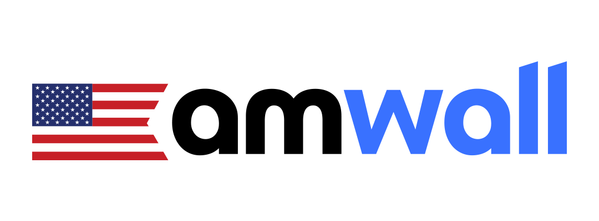
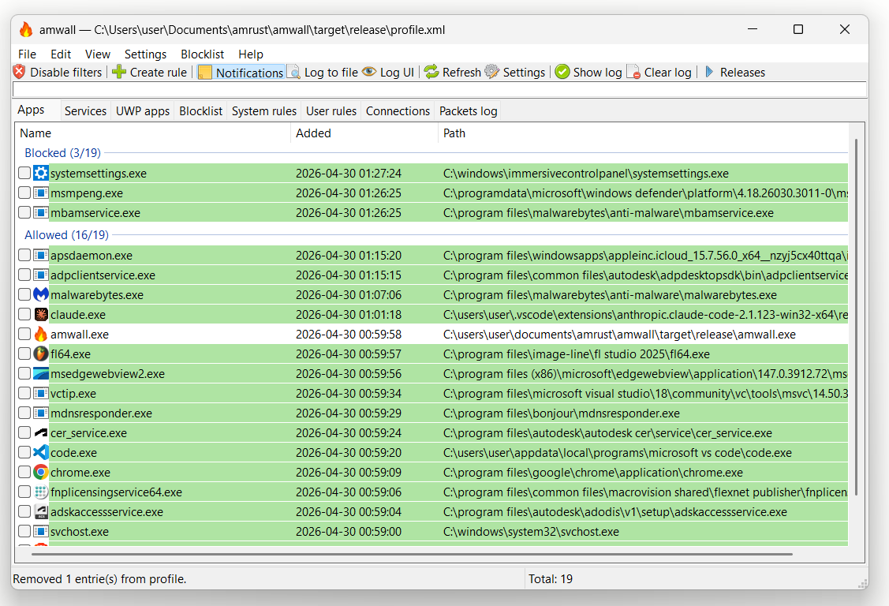

<p align="center">
  
</p>

<p align="center">
  <a href="https://github.com/amrust/amwall/releases/latest"></a>
  <a href="https://github.com/amrust/amwall/releases"></a>
  <a href="https://github.com/amrust/amwall/issues"></a>
  <a href="https://github.com/amrust/amwall/graphs/contributors"></a>
  <a href="LICENSE"></a>
</p>

<p align="center">
  <a href="https://github.com/amrust/amwall/releases/latest/download/amwall-x86_64.msi">
    
  </a>
</p>

<p align="center">
  
</p>

# amwall

A Rust port of [simplewall](https://github.com/henrypp/simplewall), a lightweight tool for configuring [Windows Filtering Platform (WFP)](https://learn.microsoft.com/en-us/windows/win32/fwp/windows-filtering-platform-start-page) — the kernel-level network filtering API that sits underneath Windows Firewall.

> **Status:** Live progress and roadmap tracked in [issue #1](https://github.com/amrust/amwall/issues/1). Installer downloads at [Releases](https://github.com/amrust/amwall/releases).

## Goal

Reproduce the functionality of upstream `simplewall` (currently v3.8.7) in idiomatic Rust:

- Configure WFP filters to allow/block per-application network traffic
- Same default-deny posture for outbound and inbound
- Same XML profile format on disk so existing simplewall users can migrate
- Same rule syntax (IPs, CIDR, ranges, ports — see upstream README)
- GUI parity (rules editor, app list, log view, notifications)
- Internal blocklist support (Windows telemetry rules)
- IPv6, UWP/Windows Store apps, WSL, and Windows services support
- 64-bit and ARM64 Windows 7 SP1+ targets, matching upstream

## Why Rust

- Memory safety in code that interacts with kernel-level APIs and parses untrusted XML
- Stronger types around WFP's `FWPM_*` structures and GUIDs
- Easier cross-compilation to ARM64
- No new functionality vs. upstream — the port is a re-implementation, not a fork with changes

## License

GPL-3.0-or-later, same as upstream simplewall. As a derivative work, this license is required (see `NOTICE` and `LICENSE`).

Original simplewall © 2016-2026 Henry++.

## Building

### Quick build (just the binary)

```
cargo build --release
```

Requires Rust 1.85+ and the Windows SDK. Output: `target\release\amwall.exe`.

### VS Code tasks (Ctrl+Shift+B)

The repo ships [`.vscode/tasks.json`](.vscode/tasks.json) with five tasks. Ctrl+Shift+B picks up the default ("Build MSI installer"); the others are reachable via Ctrl+Shift+P → **Tasks: Run Task**.

| Task | What it does |
|---|---|
| **Build MSI installer** *(default — Ctrl+Shift+B)* | Ensures cargo-wix is installed, runs `cargo build --release --target x86_64-pc-windows-msvc`, then runs `cargo wix` to produce `target\wix\amwall-<version>-x86_64.msi`. Errors out with install instructions if the WiX Toolset 3.x isn't on PATH. |
| **Reveal MSI in Explorer** | Opens `target\wix` in Explorer with the freshest MSI selected. |
| **Rebuild amwall (clean + release, stderr → swaplog.txt)** | `cargo clean` then build + run with stderr captured to `swaplog.txt` for live debugging. |
| **Build amwall (release, stderr → swaplog.txt)** | Same as Rebuild but skips `cargo clean`. Faster. |
| **Build + run amwall ELEVATED (UAC, stderr → swaplog.txt)** | Builds release, then UAC-elevates to launch `amwall.exe`. The elevated `cmd.exe` wrapper handles the stderr redirect since `Start-Process -Verb RunAs` can't pipe stdio. Helper script: [`.vscode/run-elevated.ps1`](.vscode/run-elevated.ps1). |

Building the MSI locally requires [WiX Toolset 3.x](https://github.com/wixtoolset/wix3/releases) on PATH (`candle.exe` / `light.exe`):

```
choco install wixtoolset -y    # from an elevated shell
```

### Building the MSI without VS Code

Same chain the workflow runs:

```
cargo install cargo-wix --locked
cargo build --release --target x86_64-pc-windows-msvc
cargo wix --no-build --nocapture --target x86_64-pc-windows-msvc
```

Output: `target\wix\amwall-<version>-x86_64.msi`.

## Releasing

Releases are produced by the [`release` workflow](.github/workflows/release.yml) running on `windows-latest`. It fires **only on tag push**, not on every commit. The workflow runs the full gating triad (`cargo build --release`, `cargo clippy --all-targets -- -D warnings`, `cargo test`), then `cargo wix`, then attaches the MSI to a **draft** GitHub Release.

### Cutting a release

1. **Bump the version** in [`Cargo.toml`](Cargo.toml) under `[package].version`. Update [`Cargo.lock`](Cargo.lock) by running any `cargo` command (e.g. `cargo build --release`).
2. **Commit** the bump:
   ```
   git add Cargo.toml Cargo.lock
   git commit -m "release: bump version to X.Y.Z"
   git push origin main
   ```
3. **Tag** the commit. Use an annotated tag so GitHub's release page picks up the message:
   ```
   git tag -a vX.Y.Z -m "amwall X.Y.Z - <one-line summary>"
   ```
4. **Push the tag** — this triggers the workflow:
   ```
   git push origin vX.Y.Z
   ```
5. **Watch the build** at https://github.com/amrust/amwall/actions. Cold cache: ~5–7 min. Warm: ~1–2 min.
6. **Review and publish the draft Release**. On success, a draft appears at `https://github.com/amrust/amwall/releases/tag/vX.Y.Z` with the MSI attached and auto-generated changelog. To publish:
   ```
   gh release edit vX.Y.Z --draft=false
   ```
   …or use the GitHub Releases page: **Edit** → **Set as the latest release** → **Publish release**.

The published release becomes the `releases/latest` URL. amwall's built-in update check (`Settings → Check for updates`) compares its compiled-in `CARGO_PKG_VERSION` against this and pops a notify-only dialog when a newer release exists.

### If the workflow fails

The first build chain runs on the just-pushed tag. If it fails, the tag points at a broken state with no Release attached. Two recovery paths:

- **Re-point the tag** (cleanest if no one's downloaded the broken commit yet, e.g. failures during the Build MSI step happen before the Release is created):
  ```
  git tag -d vX.Y.Z
  git push --delete origin vX.Y.Z
  # ...fix the bug, commit, push to main...
  git tag -a vX.Y.Z -m "..."
  git push origin vX.Y.Z
  ```
- **Bump to vX.Y.Z+1** if the broken release was already public (don't rewrite published history).

### MSI internals

The installer template is [`wix/main.wxs`](wix/main.wxs). It uses `WixUI_InstallDir` (Welcome → License → InstallDir → Verify → Progress → Finish), with the GPL-3.0 license text in [`wix/License.rtf`](wix/License.rtf) (regenerate from `LICENSE` with the PowerShell snippet at the top of that file's commit, if upstream's text changes). Stable GUIDs in `main.wxs` should not be regenerated — they're how the MSI recognises an upgrade vs. a fresh install.

## Roadmap

Tracked in GitHub issues. The high-level milestones are:

1. WFP bindings — wrap `fwpuclnt.dll` and provider/sublayer/filter primitives via `windows-rs`
2. Profile I/O — read/write upstream `profile.xml` format
3. Rules engine — parse rule strings, compile to WFP filter conditions
4. CLI surface — `-install`, `-install -temp`, `-install -silent`, `-uninstall`
5. GUI — equivalent of the Win32 main window, rules editor, log viewer
6. Notifications — packet-drop notifications and logging
7. Internal blocklist — load `profile_internal.sp`
8. Localization — load `simplewall.lng`
9. Installer + portable mode parity

## Contributing

Issues and PRs welcome.

**Scope.** amwall started as a strict parity port of upstream [henrypp/simplewall v3.8.7](https://github.com/henrypp/simplewall) and v1.0 reached that bar. From v1.1 onward the scope expanded to also include **community-wishlist items upstream has accepted but not shipped** — features that have an open issue / "+1" history in the henrypp/simplewall tracker but that henrypp hasn't had time to land. New mechanisms with no upstream basis (proprietary protocols, paid features, alternative profile formats, etc.) remain out of scope. When in doubt, cross-reference the upstream issue tracker before opening a PR.

**Local setup.**

- Rust 1.85 or newer (matches `rust-version` in [Cargo.toml](Cargo.toml))
- Windows SDK (any recent version; the `windows` crate handles version differences)
- WiX Toolset 3.x if you intend to build the MSI installer locally — `choco install wixtoolset -y` from an elevated shell

**Gate triad** — every PR must pass these locally and they're re-run on every release tag:

```
cargo build --release --target x86_64-pc-windows-msvc
cargo clippy --all-targets --target x86_64-pc-windows-msvc -- -D warnings
cargo test --target x86_64-pc-windows-msvc
```

The release workflow won't produce an MSI if any of these fail, so a PR that breaks them blocks releases for everyone.

**Live testing.** Many WFP behaviours can't be exercised from `cargo test` because they require admin and a live Base Filtering Engine. Tests that fall in this bucket are marked `#[ignore]` with a justification — run them with `cargo test -- --ignored` from an elevated shell. The "Build + run amwall ELEVATED" VS Code task captures stderr to `swaplog.txt` for live-session debugging.

**PR conventions.**

- Conventional-style subject line (e.g. `gui: M11.2 explicit is_silent gate`, `wfp: fix CNDL0104`)
- Commit body explains the *why* and references the upstream behaviour being matched (file + line in henrypp/simplewall when relevant)
- Reference [issue #1](https://github.com/amrust/amwall/issues/1) for milestone-shaped work
- Don't squash-merge series of milestone commits — the per-milestone history is load-bearing for the parity-tracking issue

**Reporting bugs.** Filter-management failures usually surface in `swaplog.txt` (alongside the exe in portable mode, or `%APPDATA%\amwall\swaplog.txt` in installed mode). Attach it to issues. For a snapshot of the kernel filter state at the time of the bug, run `netsh wfp show filters` from an elevated shell and attach `filters.xml`.

## Not affiliated

amwall is an independent re-implementation. It is not affiliated with, endorsed by, or sponsored by Henry++ or the original simplewall project. For the original C version, go to [henrypp/simplewall](https://github.com/henrypp/simplewall).
